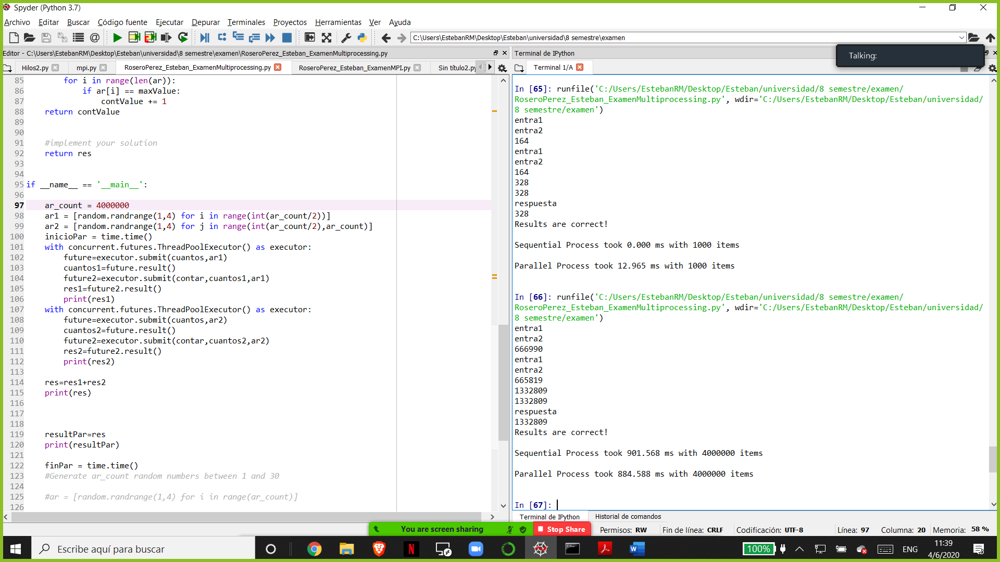
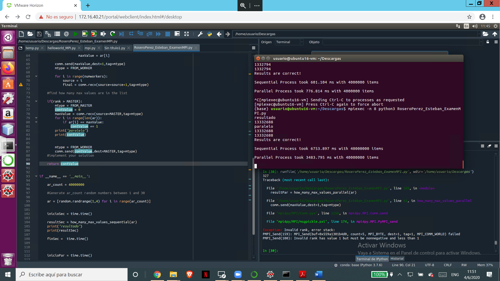

# RoseroPerez_Esteban_ExamenMultiprocessing-
# En el multiprocesing
En el multiprocesing lo que hice fue agregar dos metodos uno que llame a la funcion cuantos numeros se repiten y
otro para llamar a contar la lista de numeros repetidos con el concurrent.futures.ThreadPoolExecutor() aqui 
obtengo el valor de dos listas divididas

aqui se adjunta una foto de los resultados del Multiprocessing

# En el MPI
En el MPI se corre con esta linea en el terminal

mpiexec -n 8 python3 RoseroPerez_Esteban_ExamenMPI.py

en el MPI lo que hice fue declarar en el codigo del master la funcion de cuantos numeros se repiten y en la de from_master llamo al de contar la lista de numeros repetidos por el cual obtengo los valores de la suma

aqui se adjunta una foto de los resultados del MPI

